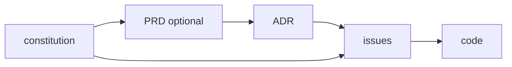

# Living Docs

**Run a project's engineering decisions as a living log — not a write-once artifact that rots.**

> **This is an experiment and it changes constantly.** Verbs and record formats may
> change between releases without a deprecation window — see ADR 0059 for the latest
> cut. Pin a release tag rather than tracking `main` if you need stability.

[](LICENSE)
[](skills/okf-knowledge-format/reference/SPEC.md)
[](#whats-in-the-box)
[](#installation)

Living Docs is an **AI agent skill** for **documentation-as-code** that keeps a
codebase's decision log in sync with its code. It works with **Claude Code**, **Cursor**,
**GitHub Copilot**, **OpenCode**, **Codex**, and **Pi** — any agent that loads
markdown "skills" / instruction files. It is stack-agnostic: it governs *how* decisions
are recorded and maintained (Architecture Decision Records, issues, research notes, an
optional PRD, a constitution, living [Mermaid](https://mermaid.js.org/) architecture
views), never *what* technology a project uses.

The mechanical half of that discipline is owned end-to-end by the bundled
**`living-docs` CLI** — one self-contained Rust binary with nine verbs that
**scaffolds records** (`new`), **drives their lifecycle** (`set`, `supersede`),
**rebuilds indexes** (`index`, `fmt`), **validates the invariants** (`check`),
**compiles the in-force view an agent reads** (`effective`), and **serves the skill
corpus and the enforcement hooks** (`skill`, `hooks`). There is no LLM inside the
tool: the agent writes only the judgment prose; everything mechanical is deterministic
and reproducible.

The whole discipline collapses to one spine:

> **Every piece of knowledge has exactly one home, that home is indexed, and a
> material decision ships with its record.**

Everything else — the constitution, ADRs, PRDs, issues, research notes and
architecture views — hangs off that spine.

---

## Why this exists

Most documentation rots because there is no contract keeping it honest. Living
Docs adds five governance invariants that an agent (or a human) can re-derive
every action from:

1. **Docs-first.** Author the body in the repo (`docs/…`) *before* publishing
   to any tracker or wiki. The repo file is the source of truth; the external
   copy is a mirror.
2. **One home per fact.** Each concept, decision, or requirement lives in
   exactly one file. Cross-reference instead of copying — duplicated prose is
   drift waiting to happen.
3. **Indexed or it doesn't exist.** Every doc is reachable from an `index.md`.
   No orphan files.
4. **Supersede, never rewrite history.** Decisions are append-only. When
   something changes, mark the old record superseded and write a new one —
   never silently edit the past.
5. **No structural change without its doc.** New module, moved files, schema
   change, new data flow → update the relevant doc *and its diagram* in the
   same change. No "I'll document it later."

These invariants are carried **in YAML frontmatter as a fact contract** and wired
to a deterministic CLI (`living-docs`) that both authors the mechanical parts and
checks them. The pitch is **not** novelty —
arc42 + ADR + C4 + docs-as-code is a well-trodden stack — it is the **explicit,
agent-enforceable packaging** of it. See [Provenance](#provenance--honest-attribution).


---

## The doc trail

Only what a change earns appears. A routine change is an issue and code; a decision
expensive to reverse earns an ADR; a product spec worth pinning earns a PRD:



| Artifact | The one question it answers |
|---|---|
| **constitution** | What never changes here? Scope, non-negotiables, the root of trace. |
| **PRD** (optional) | Who asked, what is out of scope, what does success look like? |
| **ADR** | What did we choose, what did we reject, and why? A decision expensive to reverse. |
| **issue** | What is the change, and how do we know it is done? Carries any cheap-to-reverse choice inline. |
| **research** | What does external evidence say? Dated, sourced, append-only. |
| **code** | The implementation the records govern. |

**The one rule that decides whether to write a record:** write an ADR when a future
reader would pay to rediscover *why* you chose this over the alternatives. Otherwise put
the choice in the issue. When in doubt, it is an issue.

---

## What's in the box

| Path | What it is |
|---|---|
| [`skills/living-docs/`](skills/living-docs/) | The skill: the five invariants, the doc trail, per-doc-type conventions (`rules/`) and starter templates (`templates/`). |
| [`skills/okf-knowledge-format/`](skills/okf-knowledge-format/) | The **format** standard the docs use — Open Knowledge Format (OKF): markdown + YAML frontmatter, required `type`, reserved `index.md`/`log.md`, bundle-relative links. The OKF spec is **vendored verbatim** from Google Cloud Platform. |
| [`skills/research-artifacts/`](skills/research-artifacts/) | The research-note format and source discipline that feeds ADRs (the `docs/research/` half of the trail). |
| [`cli/`](cli/) (authoring verbs) | **Deterministic authoring**: `new` scaffolds a record with CLI-owned numbering, frontmatter and title heading, and every body section as a `{{SLOT: hint}}` the agent replaces with prose. `set` sets the lifecycle fields, `supersede` wires both link directions and writes the retired-record callout, `index` rebuilds every index, `fmt` canonicalizes frontmatter. Architecture is a first-class doc type: `new view "<name>" --kind <context\|container\|component\|flow\|sequence\|state\|data-model\|deployment>` scaffolds one view per concern in `docs/architecture/`, and the generated index sorts them in C4/arc42 zoom order. |
| [`cli/`](cli/) (`living-docs effective`) | **The agent-facing read**: active records only, supersede chains collapsed to the head with a one-line lineage, retired records withheld and counted. `--topic <term>` filters, `--full` prints bodies. An agent reads this, never `index.md`. |
| [`cli/`](cli/) (`living-docs check`) | The **deterministic checker** for the mechanical invariants — frontmatter/`type`, indexing + reachability, link resolution, supersede integrity and the retired-record callout, unfilled `{{SLOT}}` placeholders, and Mermaid fences (in-process via the pure-Rust [`merman-core`](https://crates.io/crates/merman-core) parser — no Docker, no daemon). A single self-contained binary: native `serde_yaml` frontmatter parsing and native `pulldown-cmark` link extraction — no host tools needed. *A constraint without an instrument is a vibe*; this is the instrument. It runs at commit and in CI. |
| [`cli/`](cli/) (`living-docs skill` / `hooks`) | The skill corpus travels **inside the binary** and is served on demand (`skill --list`, `skill living-docs --topic adr`); `hooks install` materializes the session-teaching hook and the pre-commit doc-gate into a project. |
| [`references/prior-art-landscape.md`](references/prior-art-landscape.md) | The sourced prior-art analysis — every part of Living Docs mapped to its established originator, so every "credit, not invention" claim has a checkable citation. |
| [`examples/linkly/`](examples/linkly/) | A worked, **lint-clean** end-to-end corpus (constitution → PRD → ADR → issue) for a fictional URL shortener — the discipline shown, not just described, and the fixture CI runs `living-docs check` against. |

Living Docs and OKF compose but do not overlap: **Living Docs governs *which* docs
exist and the no-drift discipline; OKF governs *how* a knowledge bundle's markdown
and frontmatter are shaped.**

---

## Installation

The `living-docs` CLI is a single self-contained Rust binary with **no host-tool
dependencies at all**, and packaging follows it: the binary is the unit of
distribution, and every skill/hook placement is a CLI verb, never a copy step
a shell script owns. Clone once:

```bash
git clone https://github.com/ejklock/living-docs-skill.git
cd living-docs-skill
```

Installing Living Docs is three independent steps:

1. **Install the binary.**

   ```bash
   ./install.sh          # downloads the latest release asset (sha256-verified);
                          #   LIVING_DOCS_VERSION pins a tag; falls back to `cargo build --release`
   # or:
   make cli-install       # thin wrapper over `./install.sh`
   ```

   Useful flags: `--dir <path>` (custom destination, default `~/.local/bin`),
   `--uninstall`, `--from-source`, `--dry-run`, `--help`.

2. **Place the skills** for your harness:

   ```bash
   living-docs skill install --harness claude     # ~/.claude/skills (or .claude/skills with --project)
   living-docs skill install --harness opencode    # ~/.config/opencode/skills (or .opencode/skills)
   living-docs skill install --harness codex       # ~/.codex/skills (or .codex/skills)
   living-docs skill install --harness pi          # ~/.pi/agent/skills (or .pi/skills)
   ```

   `--project` installs into the current repo instead of the global user dir;
   `--dir <path>` overrides the destination outright. Then restart the session
   so the tool picks up the skills.

3. **Arm enforcement:**

   ```bash
   living-docs hooks install [--dir <project>] [--docs-dir <bundle>] [--dry-run]
   ```

   Materializes the session-teaching script into `.living-docs/hooks/`, wires
   `.claude/settings.json` with the resolved bundle pinned as
   `LIVING_DOCS_BUNDLE=`, and installs the pre-commit doc-gate at
   `.githooks/pre-commit` (pointing `core.hooksPath` at it). Remove everything
   it wrote with the sibling `living-docs hooks uninstall`. There is
   deliberately **no write-time hook** — a pre-write block teaches the agent to
   negotiate with the block, not to use the CLI; a failing `check` in the same
   session does.

### `make` targets

```bash
make check           # full gate: version sync · file-size ratchet · cargo test ·
                     #   living-docs check the example · validate mermaid ·
                     #   hostile parser fixtures · bash -n all scripts · dry-run install.sh
make build           # build the living-docs binary natively -> target/release/living-docs
make test-fixtures   # run the hostile/negative fixtures guarding the parsers
make help            # list every target
```

### Where each tool loads from

| Tool | Mechanism | Default location (global · `--project`) | Enforcement |
|---|---|---|---|
| **Claude Code** | native `SKILL.md` skills | `~/.claude/skills` · `.claude/skills` | `living-docs hooks install` — session teaching + pre-commit doc-gate |
| **OpenCode** | native `SKILL.md` skills (also reads `.claude/skills`) | `~/.config/opencode/skills` · `.opencode/skills` | `living-docs hooks install` — pre-commit doc-gate |
| **Codex** | native `SKILL.md` skills | `~/.codex/skills` · `.codex/skills` | `living-docs hooks install` — pre-commit doc-gate |
| **Pi** | skills dir + `AGENTS.md` pointer | `~/.pi/agent/skills` · `.pi/skills` | `living-docs hooks install` — pre-commit doc-gate |

**Claude Code**, **OpenCode**, and **Codex** share the same model: they
auto-discover folders of `SKILL.md` files from their skills directory, so
`living-docs skill install` just copies the three skills there (OpenCode
additionally reads `.claude/skills`, so a Claude install already covers it).
**Pi** has no native skills directory — after the skills are copied, reference
them once from your `AGENTS.md`:

```markdown
## Living Docs
Follow the documentation discipline in skills/living-docs/SKILL.md,
skills/okf-knowledge-format/SKILL.md, and skills/research-artifacts/SKILL.md.
```

### Cursor and GitHub Copilot

Both tools read a plain markdown instruction rather than a native skills
directory, and a placement verb for two one-file harnesses isn't worth its
maintenance (ADR 0028). Point them at the skill content directly instead of
generating a file: run `living-docs skill living-docs --plain` and paste its
output into `.cursor/rules/living-docs.mdc` (with `globs: "docs/**,**/*.md"`)
or `.github/instructions/living-docs.instructions.md` (with
`applyTo: "docs/**,**/*.md"`) — or just point either tool at the installed
`SKILL.md` under your harness's skills directory. Enforcement is the same
`living-docs hooks install` step as every other harness.

### Skill content — served by the CLI, not copied to disk

Native harnesses (Claude Code, OpenCode, Codex, Pi) only get each skill's slim
`SKILL.md` stub (plus `okf-knowledge-format/reference/`, the vendored spec) — the
full per-doc-type conventions (`rules/`) and starter templates (`templates/`)
travel **inside the `living-docs` binary** and are reached with `living-docs skill`,
not by reading files off disk:

```bash
living-docs skill --list                          # every embedded skill and its topics
living-docs skill living-docs                      # the full living-docs/SKILL.md body
living-docs skill living-docs --topic adr           # just the adr topic's rules (+ template)
```

Output is **context-aware**: piped or otherwise non-TTY output defaults to minified
single-line JSON (the machine-friendly shape another agent parses); a real terminal
gets human-readable plain text. `--json` and `--plain` override the autodetection in
either direction and are mutually exclusive.

### Any other tool

Copy `skills/living-docs/`, `skills/okf-knowledge-format/`, and
`skills/research-artifacts/` into wherever that tool loads instructions from, or
just read the `SKILL.md` files — they are plain markdown meant to be read by
humans and agents alike.

### Companion skills (Matt Pocock) — referenced, not bundled

Living Docs *composes with* but does **not** bundle or install Matt Pocock's
skills. His `grill-me` (design interview before a load-bearing decision) pairs
directly with Living Docs, and his `to-prd` / `to-issues` are kindred to the
PRD/issues workflow here. Install them **straight from the source** so they
stay canonical and up to date — his repo is MIT-licensed, so cloning and using
it is permitted (keep his `LICENSE` notice if you copy files):

```bash
git clone https://github.com/mattpocock/skills.git
# his repo ships a `setup-matt-pocock-skills` skill that wires them up
```

See [`ATTRIBUTION.md`](ATTRIBUTION.md) for how Living Docs relates to his work.

---

## When to invoke

- Standing up documentation for a project (`docs/` structure, the docs index,
  ADR/issue directories).
- Reading the corpus as an agent (what governs X *now*) → `living-docs effective`.
- Writing or editing an **ADR**, **PRD**, **constitution**, or **issue** → load the
  matching topic with `living-docs skill living-docs --topic <topic>`.
- Recording **research** → the `research-artifacts` skill.
- Drawing or updating an **architecture / data-flow / sequence view**
  (living Mermaid, in-repo text that must match the code).
- A doc grew too large or mixes concerns → **split into a semantic index**.
- Enforcing the **no-drift maintenance rule** after any structural change → `living-docs check`.

---

## Composition with other skills

Living Docs is deliberately small and composes with the rest of your toolchain
rather than absorbing it: design grilling before a load-bearing ADR, a
deep-research step that gathers the evidence `research-artifacts` then formats,
and an implementation-review step that checks code honors the ADRs.

> The design-grilling step composes with **`grill-me`** by
> **Matt Pocock** ([github.com/mattpocock/skills](https://github.com/mattpocock/skills))
> — referenced, not bundled here. See [`ATTRIBUTION.md`](ATTRIBUTION.md).

---

## Provenance — honest attribution

**This work instrumentalizes established practices; it does not invent them.**
"Living documentation" is Cyrille Martraire's named methodology; ADRs are
Michael Nygard's (supersede-don't-delete is the adr-tools convention); the file
format is Google Cloud Platform's OKF, vendored verbatim; the architecture diagrams
are [Mermaid](https://mermaid.js.org/) (Knut Sveidqvist & the mermaid-js community).
None of the doc types are invented here. What is original is modest and concrete: the
**composition + the governance invariants** carried in frontmatter as a fact contract
**and enforced by a checker** — the *enforcement*, not the *invention*.

Full credits and the per-source links are in
[`ATTRIBUTION.md`](ATTRIBUTION.md) and
[`references/prior-art-landscape.md`](references/prior-art-landscape.md).

---

## Contributing

Issues and PRs welcome — the project dogfoods its own rules. See
[`CONTRIBUTING.md`](CONTRIBUTING.md) for the repo layout, the invariants it holds
itself to, how to refresh the vendored OKF spec, and how to validate a change —
`make check` runs the full gate: version sync, the file-size ratchet, the test suite,
the docs linter, the hostile parser fixtures, `bash -n` on every script, and a dry-run
of `install.sh`.

---

## FAQ

**What is an "agent skill"?**
A skill is a folder of markdown instructions (a `SKILL.md` plus optional `rules/`
and `templates/`) that an AI coding agent loads and follows. Living Docs is a
skill that teaches the agent how to keep a decision log in sync with code.

**Which tools does Living Docs work with?**
Claude Code, OpenCode, and Codex (native `SKILL.md` skills, `living-docs skill
install`), Pi (`AGENTS.md`), and Cursor and GitHub Copilot by pointing their
rule/instruction file at `living-docs skill living-docs --plain`. Because the
skill is plain markdown, any agent that reads instruction files can use it.
See [Installation](#installation).

**How is this different from a documentation generator or a wiki?**
Living Docs is not a generator and not a hosting tool. It is a *discipline* — five
no-drift governance invariants plus a doc trail (constitution → PRD → ADR →
issues → code). The agent **follows** the discipline as it works; a deterministic
CLI **authors** the mechanical half (`living-docs new` / `set` / `supersede` /
`index`) and **verifies** it (`living-docs check`) at commit and in CI. Prompt-level
guidance plus a machine check — not one pretending to be the other. Your docs live
in the repo, in Git, next to the code.

**Why is there no search, database or web UI?**
There was, and it was cut (ADR 0059): nothing in the authoring loop used it, and it
was half the code. `living-docs effective --topic <term>` and `grep` answer "where
did we decide X?" on a repo-sized corpus. A search front returns as a workspace
member the day a consumer needs cross-project search.

**What is OKF (Open Knowledge Format)?**
A vendor-neutral format from Google Cloud Platform — markdown with YAML
frontmatter, a required `type`, reserved `index.md`/`log.md`, and bundle-relative
links. Living Docs stores every doc as an OKF concept so the corpus stays
portable and agent-parseable. The spec is vendored under
[`skills/okf-knowledge-format/`](skills/okf-knowledge-format/).

**What does the `living-docs check` checker catch — and not catch?**
It is a deterministic checker over a *documented input shape*, not a general markdown/YAML validator, and its three fragile parsers (link extraction, link resolution, frontmatter reading) are guarded by hostile/negative fixtures (`make test-fixtures`). One known limit: the **structural-graph** checks — directory-index membership and index reachability — read only **inline** links in `index.md`, so a file indexed *solely* via a **reference-style** link (`[x][ref]`) is not yet detected there and would be reported as a false-positive orphan. Link *validity* itself is checked natively by **pulldown-cmark**, which parses every link form (inline, titled, angle-bracket, reference-style, and images).

**Is it tied to a specific language or framework?**
No. Living Docs is stack-agnostic — it governs documentation organization and
lifecycle, not your tech stack.

**Did you invent this?**
No, and the repo says so. Living Docs *composes* established practices (Martraire's
living documentation, Nygard's ADRs, Google's OKF). Full, sourced credits in
[`ATTRIBUTION.md`](ATTRIBUTION.md) and
[`references/prior-art-landscape.md`](references/prior-art-landscape.md).

---

## License

[MIT](LICENSE) © 2026 Evaldo Klock.

Vendored third-party content under `reference/` directories remains subject to
its own upstream license — see [`ATTRIBUTION.md`](ATTRIBUTION.md).

---

<sub>**Keywords:** living documentation · documentation as code · docs-as-code ·
AI agent skill · Claude Code skill · Cursor rules · GitHub Copilot instructions ·
OpenCode · Codex · Pi · Architecture Decision Records (ADR) · PRD · project
constitution · Mermaid architecture diagrams · semantic index · Open Knowledge
Format (OKF) · deterministic docs CLI · knowledge management · technical writing ·
software architecture · markdown documentation · no-drift docs.</sub>
