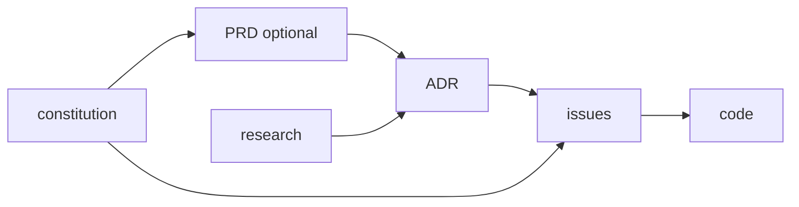

# Product Constitution

## Product

**living-docs** runs a project's engineering decisions as a living log: records are authored through a deterministic CLI (no LLM inside the tool) as git-native markdown, and an agent reads the in-force view of them through `living-docs effective` before it works.

**North Star (the first truth):** *an agent or a developer finds the decision that governs X, and only the decision in force, in one command.* "Where did we decide X?" is answered by the effective view, never by reading the raw append-only history.

## Scope Boundaries

**In scope:**

- The hexagonal `living-docs-core` (domain plus the `DocStore` port) in a Cargo workspace, with `cli` as a thin front over the `fs-store` adapter. — ADR 0002, 0033
- The nine authoring verbs over the `.md` tree: `new`, `set`, `supersede`, `index`, `check`, `fmt`, `effective`, `skill`, `hooks`. — ADR 0001, 0057, 0059
- The record taxonomy as one registry: ADR, issue, research, constitution, an optional PRD, and architecture views. — ADR 0026, 0057
- The skill corpus served from the binary, with slim harness stubs. — ADR 0014, 0017
- One gate: `living-docs check`, run by the pre-commit hook and CI, plus the session-teaching hook. — ADR 0059

**Explicitly out of scope:**

- **Any LLM inside the tool** — the tool is the deterministic layer only. (ADR 0001)
- **A database read-model, full-text search, a web or browser authoring front, multi-project catalogs, public export and its leak gate, and a write-time hook** — cut by ADR 0059. They return only as workspace fronts (ADR 0033) when a consumer needs cross-project search or an independently deployed surface; until then, `grep` and `effective --topic` answer the search question.
- **The cheaper-render split** (rendering doc prose with a cheaper model) — deferred and evidence-gated. (ADR 0001 follow-up)

## Record Model

Every record is an OKF concept: YAML frontmatter with a `type` from the registry, CLI-owned identity (`NNNN` number, singleton file, or concern-named view), CLI-owned lifecycle (`status`, `supersedes`, `superseded_by`, `timestamp`) and a body the author writes. The registry (`living-docs-core/src/doc_type.rs`) is the single enumeration of types, directories, templates, status vocabularies and index partitions (ADR 0026, 0029).

**Invariants.** A record has exactly one home and is reachable from its directory index. A retired record (`Superseded`, `Deprecated`) carries a CLI-written callout and never counts as in force. `supersede` links are bidirectional and one-to-one. An unfilled template slot is a `check` violation.

## Non-negotiables

- **No LLM inside the tool.** Every output is reproducible from its inputs. (ADR 0001)
- **`.md` in git is the source of truth.** There is no second backend to reconcile. (ADR 0059)
- **A record is earned by materiality, not by layer.** An ADR exists only when a decision is expensive to reverse and names the alternative it rejected; everything else lives in the issue. (ADR 0057)
- **The CLI binary stays self-contained.** No host tools, no daemon, no database. (ADR 0004 lineage, ADR 0059)
- **Every delivery is a vertical, demoable slice** — runnable end-to-end and observable by a human; no horizontal "layer-only" increments.
- **Code carries no comments except language docblocks**; complexity budget (cyclomatic ≤ 10, ≤ 8 new); tests assert observable behavior. (CLAUDE.md)

## Amendment Log

## Amendment 1 — 2026-09-18: scope cut to the authoring core (ADR 0059)

The read-model, search, web front, ParadeDB, multi-project catalog, db-mode authoring, public export and the write-time hook leave the scope; the data-model section describing the relational store is replaced by the record model above.
