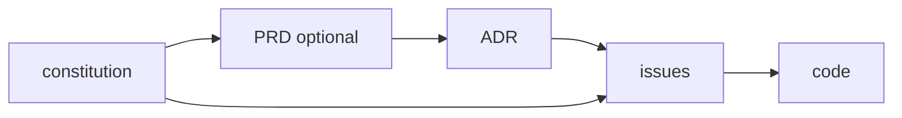

# Doc trail & record types

## Doc trail

A decision is traceable from its rationale down to the code. Only what a change earns appears — a routine change is just an issue and code; a material decision earns an ADR; a PRD appears only when there is a spec worth pinning.

## The record types — one question each

Four types answer four genuinely different questions, plus an optional PRD. Term overlap is what makes an agent write two records for one change, so each type is defined by the *one question it answers* and by when it is **not** that type.

| Type | The one question it answers | When it is NOT this type |
|---|---|---|
| **ADR** | What did we choose, what did we reject, and why? (a decision expensive to reverse) | If no alternative was rejected and a future engineer would do nothing differently without it → put the choice in the issue, not an ADR. |
| **Issue** | What is the change, and how do we know it is done? | If there is no diff to make, only a claim about the outside world → it is research. |
| **Research** | What does external evidence say? | If no external source backs it → it is opinion, not research. |
| **Constitution** | What never changes here? | If it can change per feature → it is a PRD or an ADR, not the constitution. |
| **PRD** (optional) | Who asked, what is out of scope, what does success look like? | If there is no who-asked / out-of-scope worth pinning → it is a large issue. |

There is no separate record for behavior: behavior is specified by tests, and a test-strategy *decision* is an ADR `tags: [testing]`. Rationale for a choice is the ADR; the change that realizes it is the issue; the evidence behind it is research. One fact, one home.

## The leak table — content in the wrong record

Agents learn boundaries from counterexamples better than from definitions. Each row is content that commonly leaks, the type it lands in, and where it belongs.

| Leaked content | Landed in | Belongs in |
|---|---|---|
| Test results, benchmark numbers, JSON output | ADR | issue (or research if externally sourced) |
| Implementation checkpoints / a delivery plan | ADR | issue |
| A deferred decision ("Needs an ADR") | issue | decide in the issue now, or open the ADR now |
| A source-less claim about the industry | ADR Context | research, or delete |
| A cheap, easily-reversed choice given its own ADR | ADR | the issue's body |
| An unfilled `{{PLACEHOLDER}}` | any record | fill it, or remove the slot (`check` fails on it) |

## Document map

| Type | Lives in | Purpose | Mutability |
|---|---|---|---|
| Project guide | `CLAUDE.md` / `README.md` (root) | Entry point: scope, stack, docs index, mandatory workflows | Live — edit freely |
| Constitution | `docs/constitution.md` | Foundational source of truth: product scope, non-negotiables | Amend-only once ratified (amendment log) |
| Architecture | `docs/architecture/` + index | Living Mermaid views: structure, data model, flows | Live — must match code |
| ADR | `docs/adr/NNNN-slug.md` | One decision expensive to reverse, with its alternatives | Append-only (supersede) |
| PRD | `docs/prd/NNNN-slug.md` | One feature/product requirement spec | Append-only once accepted |
| Issue | `docs/issues/NNNN-slug.md` | Tracker mirror (body), one per ticket; carries cheap decisions inline | Body editable; published copy follows |
| Research | `docs/research/NNNN-<slug>.md` | External evidence with sourced claims | Append-only (evidence is dated) |

Each directory carries its own `index.md` listing (OKF §6, no frontmatter). The project guide's "Docs index" links to the bundle-root `docs/index.md`. See `rules/semantic-index.md` for the indexing contract.
