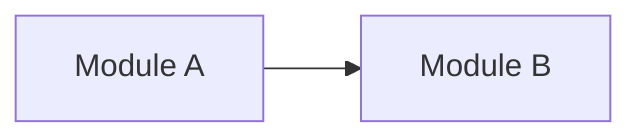

# <View name>

{{ORIENTATION_SENTENCE: what this view shows and for whom; one view per concern, nodes named with the context vocabulary}}

## Drift instrument

Drift caught by: {{INSTRUMENT: the conformance check, schema diff, or inspection rule that catches drift for this view}}
