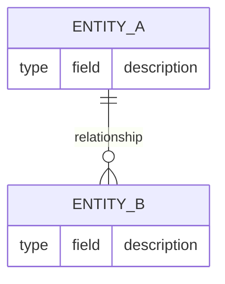

# Product Constitution

## Product

{{PRODUCT: what the product is and who it serves, in one or two sentences; every PRD and ADR must be consistent with it}}

## Scope Boundaries

**In scope:**

- {{IN_SCOPE}}

**Explicitly out of scope:**

- {{OUT_OF_SCOPE: the tempting-but-excluded capability, named so it cannot creep in}}

**Phase boundaries:**

- Phase 1: {{PHASE_1_SCOPE}}
- Phase 2: {{PHASE_2_SCOPE}}

## Data Model / Schema Foundation

{{DATA_MODEL: the core entities, cardinalities and invariants the diagram above shows}}

## Non-negotiables

- {{NON_NEGOTIABLE: a constraint that holds regardless of feature or phase, falsifiable against the running system}}

## Amendment Log

Amendments are appended here as `## Amendment N — YYYY-MM-DD: summary`; the sections above are not edited once ratified.
