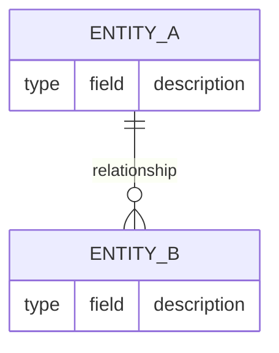

# Product Constitution

<!-- Status lives in frontmatter (`status`: Draft | Ratified | Amended). This file is
     singular — no NNNN prefix, and it is NOT listed as a concept in any index.md.
     It is the bundle's root of trace. -->

## Product

<!-- What the product is, in one or two sentences. State the core value it delivers and
     who it delivers it to. This is the north star -- every PRD and ADR must be consistent
     with it. -->

{{PRODUCT}}

## Scope Boundaries

**In scope:**

- {{IN_SCOPE}}

**Explicitly out of scope:**

<!-- Name the tempting-but-excluded capability so it cannot silently creep in. -->

- {{OUT_OF_SCOPE}}

**Phase boundaries:**

- Phase 1: {{PHASE_1_SCOPE}}
- Phase 2: {{PHASE_2_SCOPE}}

## Data Model / Schema Foundation

<!-- The core entities and their relationships. This section fixes what the rest of the
     system is built on. Represent structure as a Mermaid entity-relationship or class
     diagram. Describe cardinalities and invariants in prose below the diagram. -->

{{DATA_MODEL}}

## Non-negotiables

<!-- Constraints that hold regardless of feature set, phase, or implementation choice.
     Examples: compliance requirements, security invariants, performance floors, user-trust
     commitments. Each item should be falsifiable -- someone could check the running system
     and say "violated" or "holds". -->

- {{NON_NEGOTIABLE}}

## Amendment Log

<!-- Append amendments here; do not edit sections above once ratified.            -->
<!-- Format: ## Amendment N — YYYY-MM-DD: {{SUMMARY}}                              -->
<!-- A directory-level log.md (OKF §7) MAY also record amendment history.          -->
